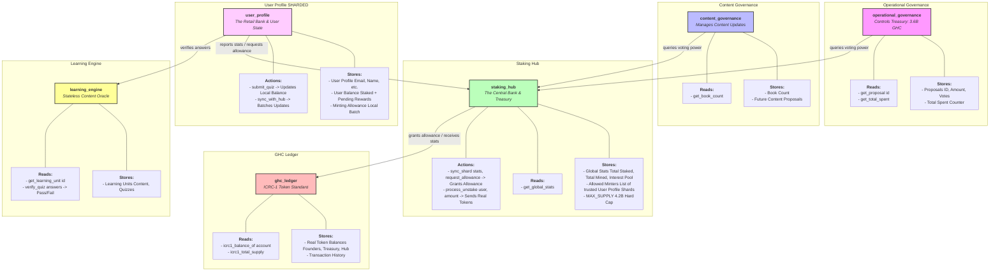

```mermaid
graph TD
    subgraph "Operational Governance"
        OP_GOV[<b>operational_governance</b><br/><i>Controls Treasury: 3.6B GHC</i>]
        OP_STORE[<b>Stores:</b><br/>- Proposals ID, Amount, Votes<br/>- Total Spent Counter]
        OP_READ[<b>Reads:</b><br/>- get_proposal id<br/>- get_total_spent]
        OP_GOV --- OP_STORE
        OP_GOV --- OP_READ
    end

    subgraph "Content Governance"
        CONT_GOV[<b>content_governance</b><br/><i>Manages Content Updates</i>]
        CONT_STORE[<b>Stores:</b><br/>- Book Count<br/>- Future Content Proposals]
        CONT_READ[<b>Reads:</b><br/>- get_book_count]
        CONT_GOV --- CONT_STORE
        CONT_GOV --- CONT_READ
    end

    subgraph "Staking Hub"
        STAKE[<b>staking_hub</b><br/><i>The Central Bank & Treasury</i>]
        STAKE_STORE[<b>Stores:</b><br/>- Global Stats Total Staked, Total Mined, Interest Pool<br/>- Allowed Minters List of trusted User Profile Shards<br/>- MAX_SUPPLY 4.2B Hard Cap]
        STAKE_READ[<b>Reads:</b><br/>- get_global_stats]
        STAKE_ACTIONS[<b>Actions:</b><br/>- sync_shard stats, request_allowance -> Grants Allowance<br/>- process_unstake user, amount -> Sends Real Tokens]
        STAKE --- STAKE_STORE
        STAKE --- STAKE_READ
        STAKE --- STAKE_ACTIONS
    end

    subgraph "GHC Ledger"
        LEDGER[<b>ghc_ledger</b><br/><i>ICRC-1 Token Standard</i>]
        LEDGER_STORE[<b>Stores:</b><br/>- Real Token Balances Founders, Treasury, Hub<br/>- Transaction History]
        LEDGER_READ[<b>Reads:</b><br/>- icrc1_balance_of account<br/>- icrc1_total_supply]
        LEDGER --- LEDGER_STORE
        LEDGER --- LEDGER_READ
    end

    subgraph "User Profile SHARDED"
        USER[<b>user_profile</b><br/><i>The Retail Bank & User State</i>]
        USER_STORE[<b>Stores:</b><br/>- User Profile Email, Name, etc.<br/>- User Balance Staked + Pending Rewards<br/>- Minting Allowance Local Batch]
        USER_ACTIONS[<b>Actions:</b><br/>- submit_quiz -> Updates Local Balance<br/>- sync_with_hub -> Batches Updates]
        USER --- USER_STORE
        USER --- USER_ACTIONS
    end

    subgraph "Learning Engine"
        LEARN[<b>learning_engine</b><br/><i>Stateless Content Oracle</i>]
        LEARN_STORE[<b>Stores:</b><br/>- Learning Units Content, Quizzes]
        LEARN_READ[<b>Reads:</b><br/>- get_learning_unit id<br/>- verify_quiz answers -> Pass/Fail]
        LEARN --- LEARN_STORE
        LEARN --- LEARN_READ
    end

    %% Relationships
    OP_GOV -- "queries voting power" --> STAKE
    CONT_GOV -- "queries voting power" --> STAKE
    STAKE -- "grants allowance / receives stats" --> LEDGER
    USER -- "reports stats / requests allowance" --> STAKE
    USER -- "verifies answers" --> LEARN

    style OP_GOV fill:#f9f,stroke:#333,stroke-width:2px
    style CONT_GOV fill:#bbf,stroke:#333,stroke-width:2px
    style STAKE fill:#bfb,stroke:#333,stroke-width:2px
    style LEDGER fill:#fbb,stroke:#333,stroke-width:2px
    style USER fill:#fcf,stroke:#333,stroke-width:2px
    style LEARN fill:#ff9,stroke:#333,stroke-width:2px
```

